# EC2 Monitoring and Remediation System – ServiceNow Implementation

## System Overview
This project implements the **ServiceNow portion** of an EC2 Monitoring and Remediation System.  
The purpose is to provide Netflix’s DevOps team with a **centralized response system** that:  
- Detects when an EC2 instance fails (status = OFF)  
- Automatically triggers workflows in ServiceNow  
- Provides AI-powered remediation guidance from the Knowledge Base  
- Sends Slack notifications to alert engineers in real time  
- Allows engineers to remediate the instance with a **one-click UI Action**  
- Logs every remediation attempt in a dedicated table for auditing  

📸 ServiceNow application scope showing **EC2 Monitoring and Remediation** with tables included   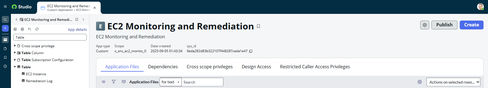

---

## Implementation Steps
The ServiceNow portion included these key components:

1. **Custom Tables**  
   - `EC2 Instance` – stores instance name, ID, and status (`ON` or `OFF`).  
   - `Remediation Log` – tracks remediation attempts, payloads, responses, status codes, and success flags.
   - `EC2 Monitoring Incidents` – tracks incidents created when an instance goes OFF, with SLA timers applied.  

   📸 EC2 Instance table with populated records (show ON/OFF status).  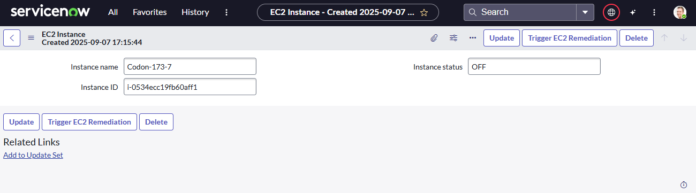
   
   📸 Remediation Log table with sample log entry. 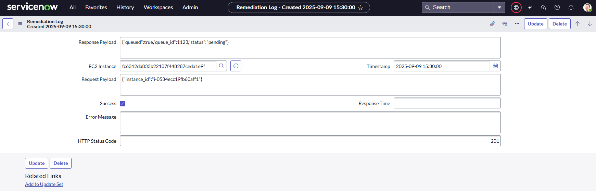

   📸 EC2 Monitoring Incidents table with open records. 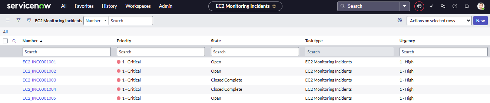 

3. **UI Action** – *Trigger EC2 Remediation*  
   - Added as a form button on EC2 Instance records.  
   - Executes client-side script using GlideAjax.  

   📸 EC2 Instance record form with the **Trigger EC2 Remediation** button. 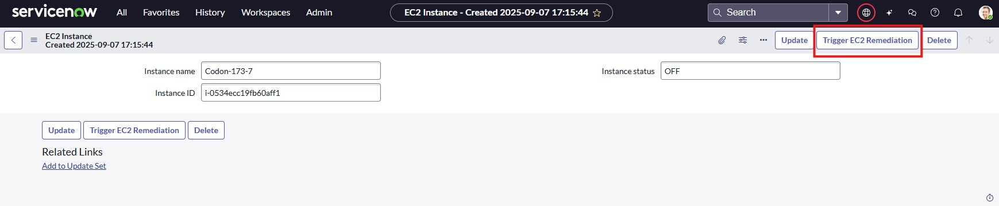 

4. **Script Include** – *EC2RemediationHelper*  
   - Handles outbound REST requests via the Connection & Credential Store (CCS).  
   - Reads instance ID, calls the AWS Integration Server, and inserts log entries.  

   📸 Script Include definition in ServiceNow Studio. 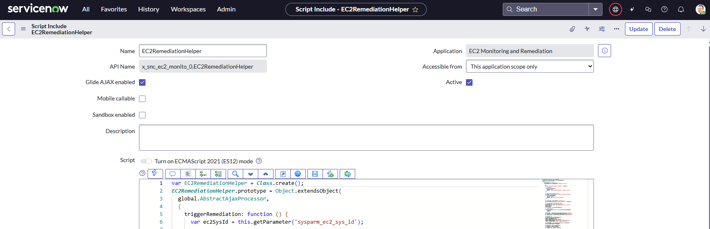  

5. **Flow Designer Workflow**  
   - Trigger: When EC2 Instance status updates to OFF.  
   - Actions:  
     - Create log record  
     - Run AI Search against Knowledge Base  
     - Post Slack notifications via webhook

   📸 Flow Designer showing trigger + actions. 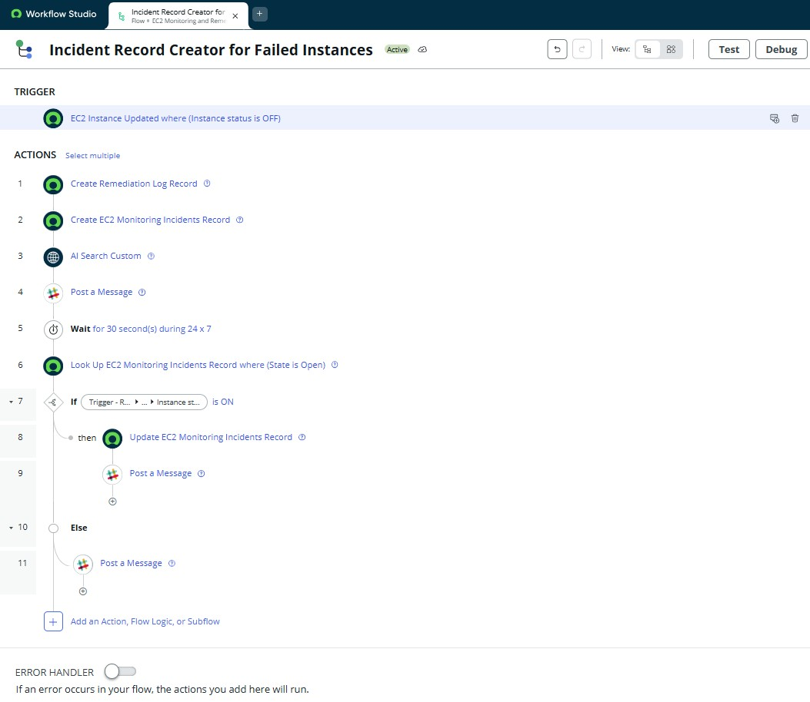   

6. **Knowledge Base Integration**  
   - Created KB article “EC2 Remediation when OFF” with keywords for AI Search discoverability.  

   📸 Published KB article content. 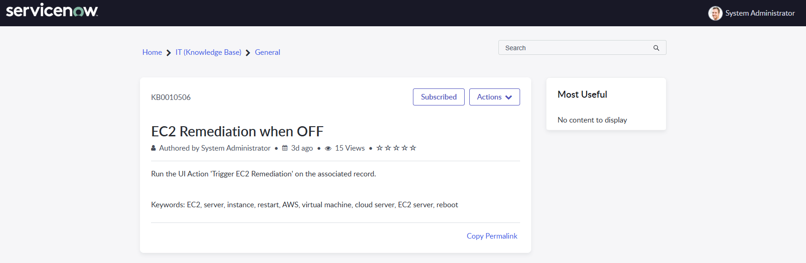   

7. **Connection & Credential Store**  
   - Alias: *AWS Integration Server C C Alias*  
   - Connection: Host + base path `/api/v1/queue/start`  
   - Credential: Basic Auth (admin user)  

   📸 Connection & Credential Alias configuration. 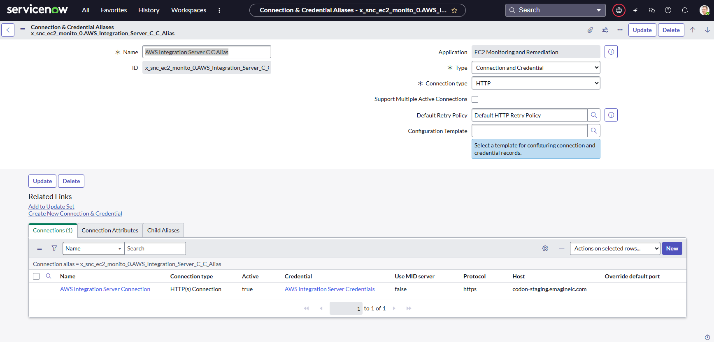   

---

## Architecture Diagram
The workflow is illustrated below:

📸 Architecture Diagram 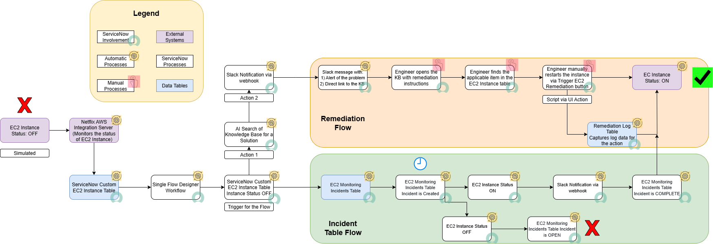   

## Flow of Events

1. EC2 Instance status changes to OFF (simulated).  
2. AWS Integration Server detects the change and updates the ServiceNow Custom EC2 Instance table.  
3. A Flow Trigger fires when the EC2 Instance status = OFF.  

### Remediation Flow  
4. AI Search queries the Knowledge Base for remediation instructions.  
5. Slack Notification is sent via webhook with:  
   - an alert of the problem, and  
   - a direct link to the KB article.  
6. The Engineer reviews the KB and identifies the remediation procedure.  
7. The Engineer opens the EC2 Instance record and clicks the Remediation UI Action.  
8. The Script Include executes the REST call to remediate the instance.  
9. The Remediation Log Table is updated with log details of the action.  
10. The EC2 Instance status is refreshed in ServiceNow to capture the latest state.  
11. The EC2 Instance status returns to ON, confirming successful remediation.  

### Incident Table Flow  
12. A record is created in the EC2 Monitoring Incidents table when the status changes to OFF, and an SLA timer (30 seconds for testing) starts.  
13. If, after the SLA wait, the EC2 Instance status = ON:  
    - The incident is automatically updated to Complete/Resolved, and  
    - A Slack Notification is sent: "The issue has been remediated."  
14. If, after the SLA wait, the EC2 Instance status = OFF:  
    - The incident remains **Open (SLA Breach)** for manual follow-up, and  
    - A Slack Notification is sent alerting engineers that manual remediation is required.  

---

## Optimization

During implementation, the following improvements were applied for reliability and efficiency:  
- **Scoped Application**: Ensured naming conventions matched AWS Integration Server requirements (`x_snc_ec2_monito_0`).  
- **Error Handling (pre-built)**: Script Include captures and logs all error responses with payload.  
- **Slack Messaging**: Used `<URL|label>` formatting to shorten links and improve readability.  
- **Incident Tracking**: Added a custom *EC2 Monitoring Incidents* table. Every time an EC2 instance goes OFF, a new incident record is automatically created.  
- **SLA Enforcement**: Defined a 30-second SLA (for testing) for the remediation on the incident table. If the instance status returns to **ON** within that period:  
  - the incident in the *EC2 Monitoring Incidents* table is auto-closed, and  
  - a Slack message is sent: *“The issue has been remediated. The instance status is ON.”*.

If the status remains **OFF**, the incident stays open for manual follow-up, and
  - a Slack message is sent: *“Critical Alert – remediation failed. EC2 Instance is still OFF beyond SLA. Escalate to on-call engineer immediately.”*. 

---

## DevOps Usage
For Netflix DevOps engineers, the workflow is:  

1. **Detection**:  
   EC2 instance status is auto-updated in ServiceNow. If OFF, a Slack alert is sent.  

2. **Guidance**:  
   Slack message contains a direct link to the relevant KB article with remediation instructions.  

3. **Remediation**:  
   Engineer opens the EC2 Instance record and clicks the **Trigger EC2 Remediation** button.  

4. **Execution**:  
   Script Include executes outbound REST → AWS Integration Server.  

5. **Audit**:  
   Remediation Log captures the attempt, payload, response, and success flag.

6. **Resolution**:  
   If the instance comes back ON, the Incident auto-resolves and a Slack confirmation is sent. If not, the Incident stays open and a Slack SLA breach message is sent.  

📸 Slack message showing KB + instance record link.  
📸 Updated EC2 record status after remediation (OFF → ON). 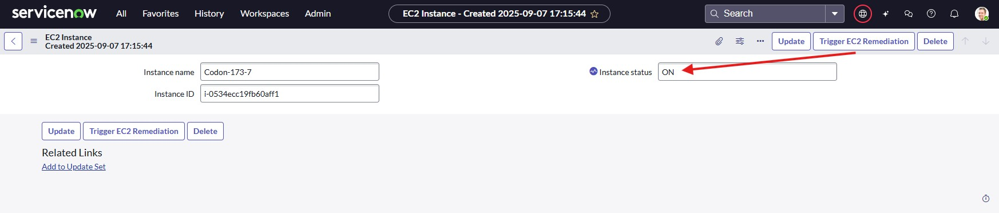  
📸 Slack messages after SLA has been reached (OFF and ON).  
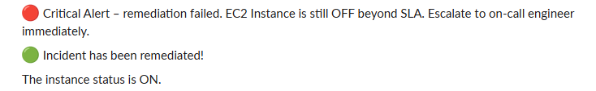  

---

